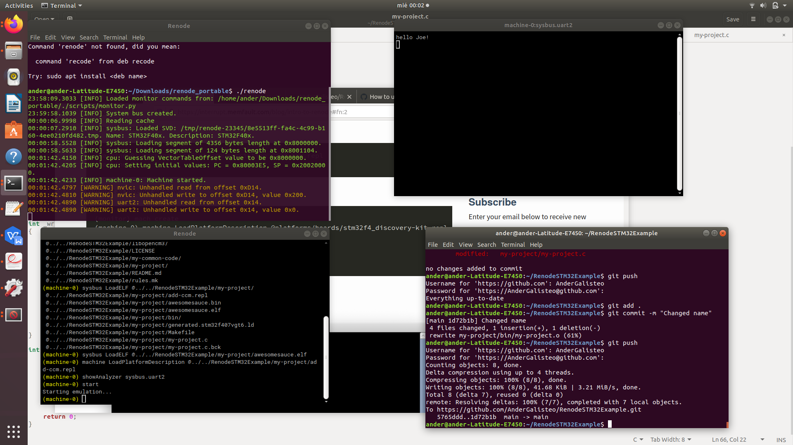

## TL;DR

In this document the steps to setup renode, simulate a stm32f4_discovery and run a hello world are going to be shown.
## Dissclaimer:
For setting up this exercise I have followed 3 tutorials. They are well documented so instead of copying the process here, I will point to them when needed.
## Hardware used
This tutorial was tested in Ubuntu 16.04

## Instructions
 1. Download renode from https://github.com/renode/renode. In my case I have followed the steps of "Using the Linux portable release". To test if the download was correct, once finished type renode from the folder you have downloaded the portable version or renode into. A new Renode window should appear.
 2. Download a project template at https://github.com/libopencm3/libopencm3-template. I did this into a different folder, to keep elements separated. Follow the steps of the Readme.
 3. Now everything is ready for the tutorial at https://interrupt.memfault.com/blog/intro-to-renode#fn:2. Take into account that the location of the files is going to differ from the one presented, depending on where you placed the project template. Following the steps you will modify the code template, configure the system and some of its peripherals, configure its memory and run the code.
## Prove of accomplishment
Apart from the code of this repo, here you can find an image showing that this setup was, in fact, tested successfully.

